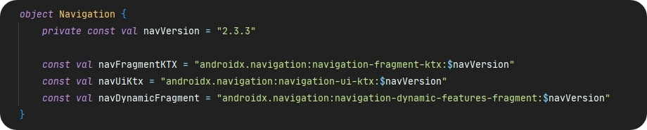

# MovieBox

  

### О проекте

MovieBox - pet-project для поиска, просмотра информации и отслеживания фильмов и сериалов. Цель проекта:

- разработка собственного дизайна;
- реализовать приятный UI и UX;
- реализовать проект с современным стеком технологий и решений;
- реализация многомодульного проекта;
- комбинация написания проекта и изучение и закрепление новых подходов и решений (см. итоги что из этого получилось);

Статус проекта: `Временно на паузе`.

Есть идея реализации схожего по смыслу проекта, но с использованием Jetpack Compose, с продуманной архитектурой и исправлением недостатков этого проекта.

## Технологии, паттерны и прочее, которые используются в проекте

- #### Архитектура:

  100% Kotlin

  - MVVM

  - Clean Arhitecture

  - Dynamic delivery modules

  - Gradle Kotlin DSL

    

  #### Core: 

  - Kotlin 1.4.30
  - Gradle 6.7.1 
  - ViewBinding

  #### Библиотеки:

  - Retrofit
  - OkHttp
  - ViewBindingDelegates
  - Kotlin Coroutines, Flow
  - Moshi (Reflect + Codegen)
  - Koin
  - Paging Library
  - Navigation Components
  - Timber
  - Pretty Logger
  - Klock
  - Localization
  - Coil
  - Firebase
  - ViewPager2
  - Ktlint
  - Jetpack Compose (тест)
  - и другие

## Архитектура

Каждый модуль внутри реализует подходы чистой архитектуры. Ниже описаны модули, которые используются в проекте:

`:feature_navigation` - содержит экраны нижней навигации и экраны, которые относятся к настройкам  

`:feature_details` - все экраны, на которых отображаются детали элементов (фильмов, сериалов, актеров)

`:feature_search` - поиск и подбор с фильтрами

`:feature_collections` - экраны с подборками (коллекциями) отсортированные по вкладкам (в тренде, популярное и т.д.)

`:feature_auth` - все, что касается авторизации в приложении

`:lib_base` - модуль, в котором находятся базовые классы, общие методы, классы и ресурсы

`:BuildSrc` - содержит все настройки проекта, библиотеки и их версии. см скрин ниже. 

	

### Немного истории и выводы

##### История

Разработка проекта началась с идеи проекта, который бы мог упростить поиск фильмов и сериалов. Хотя похожих проектов довольно много, на которых все практикуются, но такие проекты как правило очень маленькие и с базовым функционалом, а я же не просто хотел попрактиковаться, я горел этой идей и хотел реализовать более крупное приложение, со своим дизайном и дополнительным функционалом.

Все началось с попыток нарисовать какой-то минимальный набор экранов и параллельная разработка начального функционала (список фильмов и детали фильма). Далее одновременно с набросками новых экранов, приложение обрастало новым функционалом и не редко переписывался старый функционал или перестраивался дизайн на каких-то экранах. 

В итоге, в свободное время у меня стояло несколько задач:

- придумать и разрабатывать дизайн дизайн;

- разработка проекта (исправление багов и разработка нового функционала);

- исследование и поиск новых решений;

  

##### Что получилось в итоге

Проект пережил множество различных глобальных изменений:

- избавление от множества активити, приближение к single-activity;
- разбиение проекта на feature delivery модули, что забрало очень много времени и добавило новых проблем;
- попытки реализации анимации смахивания экрана (похожая логика на экранах в YouTube);
- экспериментирование с Navigation Components для сохранения логики смахивания экрана жестом;
- миграция с Glide на Coil;
- миграция с Dagger на Koin;
- миграция на Gradle Kotlin DSL;
- использование ViewBinding (как только появилась) вместо Kotlin Synthetic; 
- множественные изменения в дизайне (различные версии см. ниже), попытки разбиения его на различные компоненты, отделение иконок, шрифтов и цветов (создание дизайн системы);
- попытки оптимизации различных мест в проекте;
- реализация MVVM + MVI подхода для обработки различных состояний экрана;
- и т.д.;

В итоге, я считаю, что разработка проекта была положительным опытом. У меня все таки получилось реализовать свой дизайн почти в полном объеме, разбить проект на модули и сделать его более масштабируемым, а также использовать современные технологии и решения. 

Однако, в силу того, что проект подвергался частым *улучшениям* и иногда сказывался недостаток времени, проект частично засорился, в нем есть места, которые могут быть улучшены или исправлены. Ниже я опишу, что может быть улучшено или исправлено:

- построение архитектуры проекта на основе обычных модулей и разделение на core и feature модули;
- тестирование;
- использование функционала Coroutines и Flow на полную;
- построить зависимости для репозиториев на основе абстракций;
- оптимизация экран в xml, уменьшить вложенность;
- внедрить MVI и совместить с MVVM (как например, Roxy);

## Текущий интерфейс

 
 
 
 
 
 
 

## Часто используемые gradle таски

`/gradle packageDebugUniversalApk` - собирает apk файлы вместе с динамическими модулями

`/gradle ktlintDebugFormat` - анализ кода и его форматирование

`/gradle ktlintDebugCheck` - анализ кода и поиск мест, которые могут быть отформатированы

`/gradle dependencyUpdates` - отображает список библиотек и плагинов, которые используются в проекте, их текущую версию и последнюю версию   

## Различные версии дизайна

 
 
 
 
 

## Лицензия

Этот репозиторий находится под лицензией GNU v3. Подробную информаци вы можете найти [здесь](https://github.com/majorkik/MovieBox/blob/master/LICENSE.bat) или на [официальном сайте](https://www.gnu.org/licenses/gpl-3.0.ru.html).