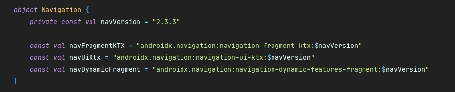

# MovieBox

## Немного о проекте

Это мой pet-project, в котором я стараюсь применять различные практики и решения, которые нахожу. В этом проекте я попытался сделать приятный интерфейс, использовать хорошие практики, современные технологии и решения, а также по возможности сделать удобное приложения для поиска и отслеживания фильмов/сериалов, которое могло бы быть удобно как мне, так и другим пользователям, поэтому при разработке старался учитывать также UX факторы.

Проект пережил множество различных глобальных изменений:

- избавление от множества активити, приближение к single-activity;
- разбиение проекта на delivery модули;
- попытки реализации анимации смахивания экрана (как экран с открытым видео на youtube);
- миграция с Glide на Coil;
- миграция на Gradle Kotlin DSL;
- использование ViewBinding (как только появилась) вместо Kotlin Synthetic; 
- множественные изменения в дизайне (различные версии, если кому-то интересно), попытки разбиения его на различные компоненты, отделение иконок, шрифтов и цветов;
- попытки оптимизации различных мест в проекте;
- реализация MVVM + MVI подхода для обработки различных состояний экрана;
- и т.д.;

Все эти изменения забирали много времени (особенно разделение проекта на модули и работа с Navigation Components ​(​будь она проклята):smile:)

На данный момент стоит выбор о дальнейшей судьбе проекта, т.к. проект за время все вышеперечисленных изменения местами засорился, то либо я его буду продолжать и доведу его до ума, либо он отправится в архив, а вместо него создам новый, который напишу с помощью Jetpack Compose (второй вариант более реален). 

## Архитектура

Каждый модуль внутри реализует подходы чистой архитектуры. Ниже описаны модули, которые используются в проекте:

`:feature_navigation` - содержит экраны нижней навигации и экраны, которые относятся к настройкам  

`:feature_details` - все экраны, на которых отображаются детали элементов (фильмов, сериалов, актеров)

`:feature_search` - поиск и подбор с фильтрами

`:feature_collections` - экраны с подборками (коллекциями) отсортированные по вкладкам (в тренде, популярное и т.д.)

`:feature_auth` - все, что касается авторизации в приложении

`:lib_base` - модуль, в котором находятся базовые классы, общие методы, классы и ресурсы

`:BuildSrc` - содержит все настройки проекта, библиотеки и их версии. см скрин ниже. 

	

## Текущий интерфейс

 
 
 
 
 
 
 

- ## Технологии, паттерны и прочее, которые используются в проекте

  - #### Архитектура:

    100% Kotlin

    - MVVM

    - Clean Arhitecture

    - Dynamic delivery modules

    - Gradle Kotlin DSL

      

    #### Core: 

    - Kotlin 1.4.30
    - Gradle 6.7.1 
    - Android Gradle plugin 4.2.0-alpha18
    - ViewBinding

    #### Библиотеки:

    - Retrofit
    - OkHttp
    - ViewBindingDelegates
    - Kotlin Coroutines, Flow
    - Moshi (Reflect + Codegen)
    - Koin
    - Paging Library
    - Navigation Components
    - Timber
    - Pretty Logger
    - Klock
    - Localization
    - Coil
    - Firebase
    - ViewPager2
    - Ktlint
    - Jetpack Compose (тест)
    - и другие

## Требования

- **Android Studio 4.1**
- **Java JDK 8**
- **Android SDK**
- **Kotlin 1.4.30**

## Часто используемые gradle таски

`/gradle packageDebugUniversalApk` - собирает apk файлы вместе с динамическими модулями

`/gradle ktlintDebugFormat` - анализ кода и его форматирование

`/gradle ktlintDebugCheck` - анализ кода и поиск мест, которые могут быть отформатированы

`/gradle dependencyUpdates` - отображает список библиотек и плагинов, которые используются в проекте, их текущую версию и последнюю версию   

## Различные версии дизайна

 
 
 
 
 

## Лицензия

Этот репозиторий находится под лицензией GNU v3. Подробную информаци вы можете найти [здесь](https://github.com/majorkik/MovieBox/blob/master/LICENSE.bat) или на [официальном сайте](https://www.gnu.org/licenses/gpl-3.0.ru.html).